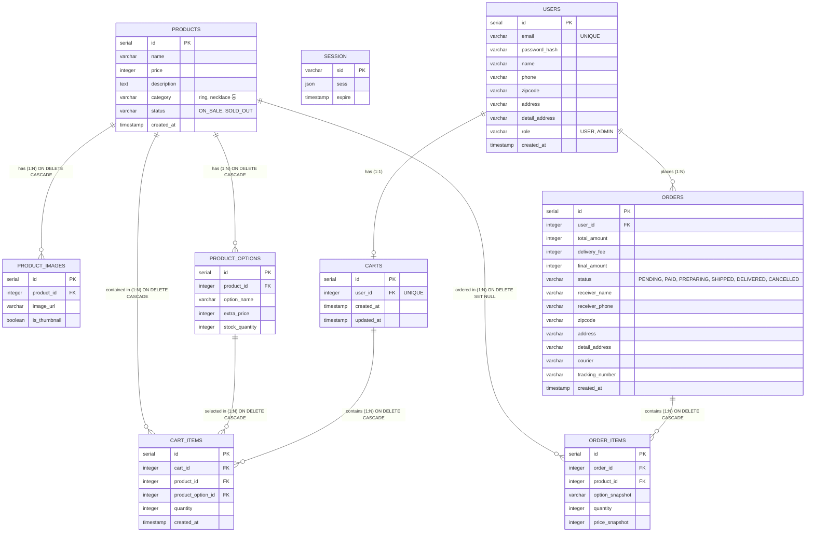

# 📊 데이터베이스 ERD (Entity Relationship Diagram)

> 본 ERD는 프로젝트의 실제 물리적 SQL 스키마(init.sql)를 기반으로 작성된 논리/물리 데이터 모델입니다.

```mermaid
erDiagram
    USERS {
        serial id PK
        varchar email "UNIQUE"
        varchar password_hash
        varchar name
        varchar phone
        varchar zipcode
        varchar address
        varchar detail_address
        varchar role "USER, ADMIN"
        timestamp created_at
    }

    SESSION {
        varchar sid PK
        json sess
        timestamp expire
    }

    PRODUCTS {
        serial id PK
        varchar name
        integer price
        text description
        varchar category "ring, necklace 등"
        varchar status "ON_SALE, SOLD_OUT"
        timestamp created_at
    }

    PRODUCT_IMAGES {
        serial id PK
        integer product_id FK
        varchar image_url
        boolean is_thumbnail
    }

    PRODUCT_OPTIONS {
        serial id PK
        integer product_id FK
        varchar option_name
        integer extra_price
        integer stock_quantity
    }

    CARTS {
        serial id PK
        integer user_id FK "UNIQUE"
        timestamp created_at
        timestamp updated_at
    }

    CART_ITEMS {
        serial id PK
        integer cart_id FK
        integer product_id FK
        integer product_option_id FK
        integer quantity
        timestamp created_at
    }

    ORDERS {
        serial id PK
        integer user_id FK
        integer total_amount
        integer delivery_fee
        integer final_amount
        varchar status "PENDING, PAID, PREPARING, SHIPPED, DELIVERED, CANCELLED"
        varchar receiver_name
        varchar receiver_phone
        varchar zipcode
        varchar address
        varchar detail_address
        varchar courier
        varchar tracking_number
        timestamp created_at
    }

    ORDER_ITEMS {
        serial id PK
        integer order_id FK
        integer product_id FK
        varchar option_snapshot
        integer quantity
        integer price_snapshot
    }

    %% Relations (Foreign Keys 기반)
    USERS ||--o| CARTS : "has (1:1)"
    USERS ||--o{ ORDERS : "places (1:N)"

    PRODUCTS ||--o{ PRODUCT_IMAGES : "has (1:N) ON DELETE CASCADE"
    PRODUCTS ||--o{ PRODUCT_OPTIONS : "has (1:N) ON DELETE CASCADE"
    PRODUCTS ||--o{ CART_ITEMS : "contained in (1:N) ON DELETE CASCADE"
    PRODUCTS ||--o{ ORDER_ITEMS : "ordered in (1:N) ON DELETE SET NULL"

    PRODUCT_OPTIONS ||--o{ CART_ITEMS : "selected in (1:N) ON DELETE CASCADE"

    CARTS ||--o{ CART_ITEMS : "contains (1:N) ON DELETE CASCADE"
    ORDERS ||--o{ ORDER_ITEMS : "contains (1:N) ON DELETE CASCADE"
```
